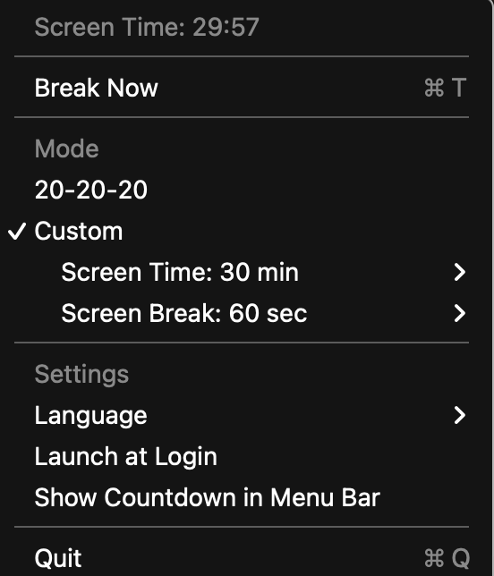
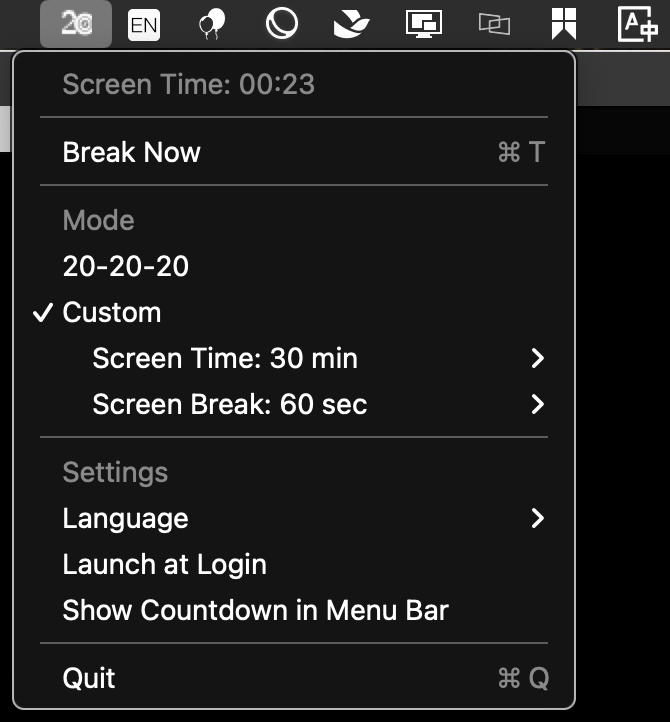

# 20-20-20 护眼助手 (macOS)

<div align="center">


*一款轻量级菜单栏应用，帮助您遵循20-20-20护眼法则*

[](https://www.apple.com/macos/)
[](https://swift.org/)
[](LICENSE)

[下载安装](#-安装) • [功能特性](#-功能特性) • [使用说明](#-使用说明) • [源码构建](#️-源码构建) • [English](README.md)

</div>

## 关于应用

**20-20-20护眼法则**是一个简单的减轻眼疲劳指南：每20分钟，看向20英尺（6米）外的物体至少20秒。这款轻量级macOS应用帮助您自动遵循这一法则。

## ✨ 功能特性

### 🎯 核心功能
- **20-20-20模式**：默认定时（20分钟工作，20秒休息）
- **自定义模式**：可调节工作时间（10-60分钟）和休息时间（10-600秒）
- **立即休息**："立即休息"选项，随时开始休息
- **智能延迟**：可延迟1、2或5分钟后再休息

### 🖥️ 用户界面
- **菜单栏集成**：不干扰的状态栏驻留
- **全屏提醒**：模态休息通知窗口
- **键盘快捷键**：快速延迟操作（⌘1、⌘2、⌘5）
- **可选倒计时**：在菜单栏显示剩余时间

### 🌍 国际化支持
- **5种语言**：English, 简体中文, Español, 日本語, 한국어
- **自动检测**：自动使用系统语言设置
- **运行时切换**：无需重启即可更换语言

### ⚙️ 系统集成
- **开机启动**：随macOS自动启动
- **设置保存**：所有偏好设置自动保存
- **深色模式**：适配系统外观主题

## 📸 截图展示

### 菜单栏界面


*应用安静地驻留在菜单栏中，提供自定义图标和完整的设置选项。*

### 休息提醒


*到了休息时间，会显示全屏提醒界面，包含延迟选项和键盘快捷键。*

## 🚀 安装

### 方式1：下载发布版（推荐）
1. 从 [Releases](https://github.com/javenfang/20-20-20-Mac-App/releases) 下载最新的 `20-20-20-Eye-Protection-App-v1.0.0.dmg`
2. 双击 DMG 文件打开
3. 将 `20-20-20.app` 拖拽到 `Applications` 文件夹
4. 推出 DMG 并删除 DMG 文件

**⚠️ 首次启动（未签名应用）：**
- 在应用程序文件夹中右键点击应用
- 从右键菜单中选择 **"打开"**
- 在确认对话框中点击 **"打开"**
- 应用现在可以正常启动了

**其他方法：**
- 在应用程序文件夹中双击应用
- macOS 会显示"无法打开，因为无法验证开发者"
- 点击"取消"
- 前往 **系统偏好设置** → **安全性与隐私** → **通用**
- 您会看到关于"20-20-20"被阻止的消息，点击 **"仍要打开"**
- 在确认对话框中点击 **"打开"**

### 方式2：从源代码构建
参见下方的 [源码构建](#️-源码构建) 部分。

## 🎮 使用说明

### 快速开始
1. 启动应用 - 它会出现在菜单栏中
2. 点击状态栏图标访问设置
3. 选择20-20-20模式或自定义时间设置
4. 应用会在适当时候提醒您休息！

### 键盘快捷键
在休息提醒期间：
- **⌘1** - 延迟1分钟
- **⌘2** - 延迟2分钟
- **⌘5** - 延迟5分钟

### 设置选项
- **模式选择**：在默认模式和自定义定时之间切换
- **自定义定时**：调整工作时间（10-60分钟）和休息时间（10-600秒）
- **语言设置**：从5种支持的语言中选择
- **自动启动**：登录时自动启动
- **菜单栏倒计时**：可选显示剩余时间

## 🛠️ 源码构建

### 环境要求
- **macOS 12.0+**
- **Xcode 14.0+** 或 **Swift 5.0+**

### 开发构建（Swift Package Manager）
```bash
git clone https://github.com/javenfang/20-20-20-Mac-App.git
cd 20-20-20-Mac-App
make build
make run
```

### 创建发布包
```bash
# 构建独立应用包
make build-app

# 创建DMG发布文件
make dmg
```

### 发布构建（Xcode）
用于App Store分发：
```bash
# 克隆并进入项目目录
git clone https://github.com/javenfang/20-20-20-Mac-App.git
cd 20-20-20-Mac-App

# 使用Xcode项目进行发布构建
# （详情参见CLAUDE.md文档）
```

## 📁 项目结构

```
20-20-20-Mac-App/
├── Sources/
│   └── TwentyTwentyTwenty/
│       ├── AppDelegate.swift           # 主应用逻辑
│       ├── BreakOverlayWindow.swift    # 休息提醒窗口
│       ├── main.swift                  # 程序入口
│       └── Resources/                  # 状态栏图标
├── Package.swift                       # Swift Package Manager配置
├── Makefile                           # 构建快捷脚本
├── CLAUDE.md                          # 技术文档
└── README.md                          # 说明文档（英文）
```

## 🌟 为什么选择这款应用？

### 轻量高效
- **小巧体积**：仅952KB安装大小
- **无后台处理**：最小CPU和内存使用
- **完全离线**：无需网络连接，保护您的隐私

### 精心设计
- **不干扰**：安静地驻留在菜单栏
- **灵活定制**：自定义时间匹配您的工作流程
- **无障碍访问**：完整的键盘导航和快捷键
- **国际化**：使用您偏好的语言

### 开源透明
- **代码公开**：完整源代码可供查看
- **可定制**：根据需要修改功能
- **社区驱动**：欢迎贡献和改进

## 🤝 贡献

欢迎贡献！请随时提交Pull Request。对于重大更改，请先开issue讨论您想要改变的内容。

### 开发环境设置
1. 克隆仓库
2. 使用Xcode或Swift Package Manager打开
3. 进行更改
4. 充分测试
5. 提交pull request

## 📄 开源许可

本项目基于MIT许可证开源 - 详见 [LICENSE](LICENSE) 文件。

## 🙏 致谢

- 灵感来源于眼科专家推荐的20-20-20护眼法则
- 使用Swift和AppKit构建，提供原生macOS体验
- 图标设计注重清晰度和系统集成

## ❤️ 支持项目

如果这款应用帮助保护了您的眼睛，改善了屏幕使用习惯，请考虑：
- ⭐ 为这个仓库点星
- 🐛 报告问题或建议新功能
- 🔄 与朋友和同事分享

---

<div align="center">

**爱护眼睛 - 它们是您唯一的一双！ 👀**

用 ❤️ 为健康的屏幕使用时间而制作

</div>