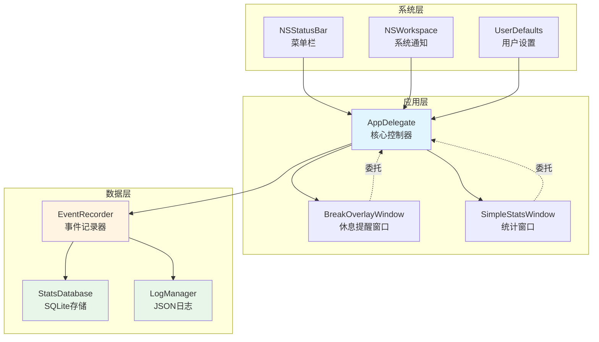
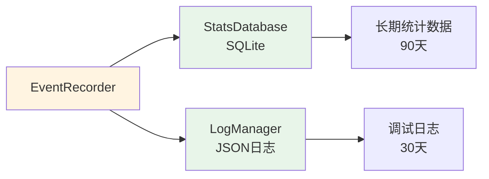
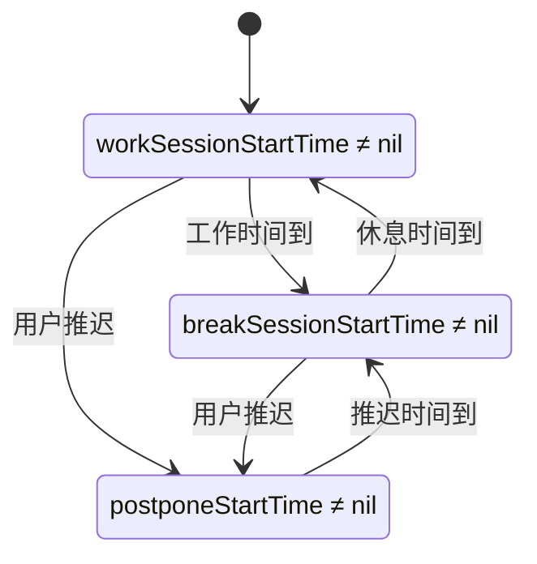
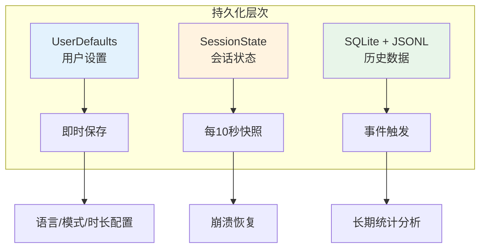

# 20-20-20 Mac App - 技术架构文档

> **文档版本**: v1.2.0
> **最后更新**: 2026-04-26
> **维护者**: Javen Fang (@javenfang)

---

## 📚 文档导航

**本文档**: 深入的技术架构和实现细节，适合**维护开发者和架构师**阅读。

**其他文档**:
- **[CLAUDE.md](../CLAUDE.md)** - 开发快速入口：构建流程、关键注意事项
- **[REQUIREMENTS.md](REQUIREMENTS.md)** - 功能需求文档：用户功能和使用场景

**何时阅读本文档**:
- ✅ 需要深入理解计时机制、状态管理、数据流
- ✅ 需要排查复杂问题（会话恢复、多屏幕管理等）
- ✅ 需要修改核心架构或添加新功能
- ✅ 需要优化性能或数据库设计

**快速查找**:
- 计时机制 → [第4章](#4-计时机制)
- 事件处理 → [第5章](#5-事件处理系统)
- 数据持久化 → [第6章](#6-持久化方案)
- 问题排查 → [10.1 常见问题排查](#101-常见问题排查)
- 数据库检查 → [10.3 数据库检查](#103-数据库检查)

---

## 📋 目录

- [1. 架构概览](#1-架构概览)
- [2. 核心组件](#2-核心组件)
- [3. 数据流与状态管理](#3-数据流与状态管理)
- [4. 计时机制](#4-计时机制)
- [5. 事件处理系统](#5-事件处理系统)
- [6. 持久化方案](#6-持久化方案)
- [7. 国际化系统](#7-国际化系统)
- [8. 构建与部署](#8-构建与部署)
- [9. 关键技术决策](#9-关键技术决策)
- [10. 维护指南](#10-维护指南)

---

## 1. 架构概览

### 1.1 整体架构

20-20-20 采用 **单一进程、事件驱动** 的原生 macOS 应用架构：



### 1.2 技术栈

- **语言**: Swift 5.9+
- **框架**: AppKit (原生 macOS UI)
- **构建系统**: Swift Package Manager
- **数据库**: SQLite3
- **最低系统**: macOS 12.0+

### 1.3 项目结构

```
Sources/TwentyTwentyTwenty/
├── main.swift                    # 入口点
├── AppDelegate.swift             # 主控制器 (1573行)
├── BreakOverlayWindow.swift      # 全屏休息窗口 (477行)
├── EventRecorder.swift           # 事件记录器 (231行)
├── StatsDatabase.swift           # SQLite数据库 (716行)
├── LogManager.swift              # JSON日志 (373行)
├── SimpleStatsWindow.swift       # 统计窗口 (363行)
├── HealthAnalyzer.swift          # 健康分析 (未使用)
└── Resources/                    # 资源文件
    ├── statusbar_icon.png        # 16x16 菜单栏图标
    └── statusbar_icon@2x.png     # 32x32 Retina图标
```

---

## 2. 核心组件

### 2.1 AppDelegate - 主控制器

**文件**: [`AppDelegate.swift`](../Sources/TwentyTwentyTwenty/AppDelegate.swift)

**职责**:
- 应用生命周期管理
- 计时器调度 (工作/休息/推迟)
- 菜单栏UI管理
- 系统事件响应
- 会话状态管理

**关键设计**:
- 使用三种 Timer：工作/休息/状态快照
- 使用绝对时间 `Date` 记录会话开始时间
- 通过计算属性实时计算剩余时间（避免累积误差）
- ⭐ v1.2.0 更新：默认模式推迟总计最多 5 分钟，自定义模式可选 5/10 分钟

📖 **详细实现**: [`AppDelegate.swift:54-86`](../Sources/TwentyTwentyTwenty/AppDelegate.swift#L54-L86)

### 2.2 BreakOverlayWindow - 休息提醒窗口

**文件**: [`BreakOverlayWindow.swift`](../Sources/TwentyTwentyTwenty/BreakOverlayWindow.swift)

**职责**:
- 全屏模态窗口显示
- 倒计时展示
- 推迟按钮处理
- 全局键盘监听 (⌘1/⌘2/⌘5)
- 多屏幕支持

**窗口层级**: `.screenSaver` (高于其他应用)

**关键特性**:
- 支持多显示器（每个屏幕一个窗口实例）
- ⭐ v1.1.0 更新：底部显示推迟状态（已推迟X分钟，剩余Y分钟）
- ⭐ v1.1.0 更新：根据剩余时间动态禁用推迟按钮
- 使用网格布局实现冒号对齐 ([`BreakOverlayWindow.swift:98-180`](../Sources/TwentyTwentyTwenty/BreakOverlayWindow.swift#L98-L180))
- 全局键盘事件监听，无需窗口焦点 ([`BreakOverlayWindow.swift:310-332`](../Sources/TwentyTwentyTwenty/BreakOverlayWindow.swift#L310-L332))
- 通过委托模式通知 AppDelegate 处理推迟请求

### 2.3 EventRecorder - 事件记录器

**文件**: [`EventRecorder.swift`](../Sources/TwentyTwentyTwenty/EventRecorder.swift)

**职责**:
- 统一事件记录入口
- 协调 SQLite 和 JSON 日志
- 会话状态管理
- 数据清理调度

**双重记录系统**:


**关键方法**:
- `startWorkSession(duration:)` - 开始工作会话
- `startBreakSession(duration:)` - 开始休息会话
- `recordPostpone(minutes:)` - 记录推迟事件
- `getTodayStats()` - 获取今日统计

### 2.4 StatsDatabase - SQLite存储

**文件**: [`StatsDatabase.swift`](../Sources/TwentyTwentyTwenty/StatsDatabase.swift)

**职责**:
- 会话数据持久化
- 每日统计汇总
- 数据查询与清理

**数据库表结构**:

```sql
-- 会话记录表
CREATE TABLE sessions (
    id INTEGER PRIMARY KEY AUTOINCREMENT,
    type TEXT NOT NULL,                -- 'work' | 'break'
    start_time TEXT NOT NULL,
    end_time TEXT,
    planned_duration INTEGER,
    actual_duration INTEGER,
    postpone_count INTEGER DEFAULT 0,
    postpone_1min INTEGER DEFAULT 0,
    postpone_2min INTEGER DEFAULT 0,
    postpone_5min INTEGER DEFAULT 0,
    total_postpone_duration INTEGER DEFAULT 0,
    status TEXT DEFAULT 'active'       -- 'active' | 'completed' | 'interrupted'
);

-- 每日统计表
CREATE TABLE daily_stats (
    date TEXT PRIMARY KEY,
    work_sessions INTEGER,
    break_sessions INTEGER,
    total_postpones INTEGER,
    postpone_1min_count INTEGER,
    postpone_2min_count INTEGER,
    postpone_5min_count INTEGER,
    total_work_minutes INTEGER,
    total_break_minutes INTEGER,
    longest_work_minutes INTEGER,
    avg_postpones_per_session REAL
);
```

**数据库文件位置**:
```
~/Library/Application Support/com.twentytwentytwenty/20_20_20_stats.db
```

### 2.5 LogManager - JSON日志

**文件**: [`LogManager.swift`](../Sources/TwentyTwentyTwenty/LogManager.swift)

**职责**:
- 结构化日志记录 (JSONL格式)
- 会话状态序列化
- 应用崩溃恢复

**日志文件位置**:
```
~/Library/Application Support/com.twentytwentytwenty/logs/
├── 2025-10-31.jsonl       # 每日日志
├── 2025-10-30.jsonl
└── current_session.json   # 当前会话状态
```

**日志事件类型** ([`LogManager.swift:11-38`](../Sources/TwentyTwentyTwenty/LogManager.swift#L11-L38)):
- 工作/休息周期: `work_started`, `work_completed`, `break_started`, etc.
- 系统事件: `system_sleep`, `screensaver_start`, etc.
- 应用事件: `app_launched`, `settings_changed`, etc.

---

## 3. 数据流与状态管理

### 3.1 工作-休息周期



**状态转换代码路径**:
1. **启动** → `applicationDidFinishLaunching` ([`AppDelegate.swift:233`](../Sources/TwentyTwentyTwenty/AppDelegate.swift#L233))
   - 尝试恢复会话 (`restoreSessionIfNeeded`)
   - 失败则启动新工作会话 (`startWorkTimer`)

2. **工作完成** → `completeWorkSession` ([`AppDelegate.swift:1005`](../Sources/TwentyTwentyTwenty/AppDelegate.swift#L1005))
   - 记录工作时长
   - 显示休息窗口 (`showBreakOverlay`)

3. **休息完成** → `completeBreakSession` ([`AppDelegate.swift:1258`](../Sources/TwentyTwentyTwenty/AppDelegate.swift#L1258))
   - 清理休息窗口
   - 重置推迟次数
   - 启动新工作会话

4. **推迟请求** → `postponeBreak` ([`AppDelegate.swift:1301`](../Sources/TwentyTwentyTwenty/AppDelegate.swift#L1301))
   - 清理休息窗口
   - 设置推迟计时器
   - 推迟时间到后重新显示休息窗口

### 3.2 重入保护机制

**问题**: 计时器可能在短时间内多次触发完成逻辑

**解决方案**: 使用布尔标志防止重入 ([`AppDelegate.swift:48-50`](../Sources/TwentyTwentyTwenty/AppDelegate.swift#L48-L50))
- `isCompletingWorkSession` / `isCompletingBreakSession` 标志
- 进入完成逻辑前检查标志，执行中设置为 `true`，完成后重置为 `false`

### 3.3 多屏幕窗口管理

**问题**: 用户可能有多个显示器，需要在所有屏幕上显示休息窗口

**解决方案** ([`AppDelegate.swift:1164-1224`](../Sources/TwentyTwentyTwenty/AppDelegate.swift#L1164-L1224)):
- 遍历 `NSScreen.screens`，为每个屏幕创建独立窗口实例
- 所有窗口共享同一个委托，任一窗口的推迟按钮被点击 → 清理所有窗口
- 使用 `cleanupBreakOverlays()` 统一清理，防止窗口残留

---

## 4. 计时机制

### 4.1 绝对时间 vs 相对时间

**采用方案**: 绝对时间记录 + 实时计算

**优势**:
- ✅ 避免累积误差（每秒重新计算，而非累加）
- ✅ 支持系统睡眠/唤醒（恢复后仍可根据开始时间计算）
- ✅ 便于会话恢复（只需保存 `Date` 对象）

**核心思想**: 记录 `workSessionStartTime: Date?`，通过 `Date().timeIntervalSince(startTime)` 计算已用时间，剩余时间 = 总时长 - 已用时间。

📖 **代码实现**: [`AppDelegate.swift:54-68`](../Sources/TwentyTwentyTwenty/AppDelegate.swift#L54-L68)

### 4.2 计时器调度策略

**三种计时器**:
1. **workTimer**: 工作期间每秒触发，更新UI和检查完成条件
2. **breakTimer**: 休息期间每秒触发，更新倒计时
3. **stateSnapshotTimer**: 每10秒记录状态快照

**启动时机**:
- `workTimer`: `startWorkTimer()` / `restartWorkTimer()`
- `breakTimer`: `startBreakTimer()`
- `stateSnapshotTimer`: 应用启动时 ([`AppDelegate.swift:261`](../Sources/TwentyTwentyTwenty/AppDelegate.swift#L261))

**停止时机**:
- 会话完成时立即停止对应计时器
- 应用退出时停止所有计时器 ([`AppDelegate.swift:850-853`](../Sources/TwentyTwentyTwenty/AppDelegate.swift#L850-L853))

### 4.3 推迟逻辑 ⭐ v1.1.0 更新

**设计原则**: 推迟是临时状态，不修改原始工作时长设置

**实现要点**:
- 使用独立的 `postponeStartTime` 和 `postponeDuration` 追踪推迟状态
- `currentWorkDuration` 保持不变（避免影响持久化设置）
- 推迟计时器到期后，自动重新显示休息窗口

**推迟限制机制** (v1.2.0 更新):
- **累计时长限制**: 使用 `totalPostponedTime` 追踪所有推迟操作的累计时间
- **可配置上限**: `maxTotalPostponeTime` 变量控制推迟上限
  - 默认模式: 固定 5 分钟上限
  - 自定义模式: 可选 5 分钟或 10 分钟上限
- **动态按钮禁用**:
  - 剩余时间 < 5 分钟 → "推迟 5 分钟"按钮禁用
  - 剩余时间 < 2 分钟 → "推迟 2 分钟"按钮禁用
  - 剩余时间 < 1 分钟 → "推迟 1 分钟"按钮禁用
- **实时状态显示**: 窗口底部显示 "已推迟 X 分钟，剩余可推迟 Y 分钟"
- **自动重置**: 完成休息后 `totalPostponedTime` 重置为 0

**核心代码路径**:
- 推迟请求处理: [`AppDelegate.swift:1301-1356`](../Sources/TwentyTwentyTwenty/AppDelegate.swift#L1301-L1356)
- UI状态更新: `updateBreakOverlaysPostponeStatus()`
- 窗口状态更新: [`BreakOverlayWindow.swift:updatePostponeStatus()`](../Sources/TwentyTwentyTwenty/BreakOverlayWindow.swift)

---

## 5. 事件处理系统

### 5.1 系统事件监听

**监听的系统通知** ([`AppDelegate.swift:538-600`](../Sources/TwentyTwentyTwenty/AppDelegate.swift#L538-L600)):

**NSWorkspace 通知**:
- 系统睡眠/唤醒: `willSleepNotification`, `didWakeNotification`
- 显示器睡眠/唤醒: `screensDidSleepNotification`, `screensDidWakeNotification`

**DistributedNotificationCenter 通知**:
- 屏幕锁定/解锁: `com.apple.screenIsLocked`, `com.apple.screenIsUnlocked`
- 屏保启动/停止: `com.apple.screensaver.didstart`, `com.apple.screensaver.didstop`

### 5.2 系统事件处理策略

**核心原则**: 屏保/睡眠本身相当于休息，唤醒后应开始新的工作会话

**处理策略** ([`AppDelegate.swift:1423-1501`](../Sources/TwentyTwentyTwenty/AppDelegate.swift#L1423-L1501)):

1. **屏保/睡眠/显示器睡眠** → 清理休息窗口 + 重置为新工作会话（用户已得到休息）
2. **屏幕锁定/解锁** → 根据时长决定：
   - 超时 > 5分钟 → 重置为新工作会话
   - 工作时间已到 → 显示休息窗口
   - 其他 → 继续之前的会话

### 5.3 单实例检测

**问题**: 防止用户同时运行多个应用实例

**解决方案** ([`AppDelegate.swift:264-306`](../Sources/TwentyTwentyTwenty/AppDelegate.swift#L264-L306)):
- 通过 `NSWorkspace.shared.runningApplications` 查找相同可执行路径的其他进程
- 如果发现已有实例运行 → 激活现有实例 + 当前实例退出
- 比较依据: 可执行文件路径 或 Bundle ID

---

## 6. 持久化方案

### 6.1 三层持久化架构



### 6.2 UserDefaults - 用户设置

**存储内容** ([`AppDelegate.swift:390-433`](../Sources/TwentyTwentyTwenty/AppDelegate.swift#L390-L433)):
- `showCountdownInStatusBar`: 是否显示倒计时
- `isCustomMode`: 是否自定义模式
- `customWorkDuration` / `customBreakDuration`: 自定义时长
- `currentLanguage`: 当前语言
- `loginItemEnabled`: 是否开机启动

**时机**: 应用启动时读取 (`loadSettings`)，设置变更时立即保存 (`saveSettings`)

### 6.3 SessionState - 会话状态

**数据结构** ([`LogManager.swift:41-60`](../Sources/TwentyTwentyTwenty/LogManager.swift#L41-L60)):
- `workStartTime` / `breakStartTime`: 会话开始时间
- `currentWorkDuration` / `currentBreakDuration`: 当前时长设置
- `pausedBySystemEvent`: 是否因系统事件暂停
- `lastSaved`: 保存时间（用于判断有效性，30分钟内有效）

**保存时机**:
- 每 10 秒自动快照 (`stateSnapshotTimer`)
- 会话状态变更时、系统事件发生时

**恢复逻辑** ([`AppDelegate.swift:308-380`](../Sources/TwentyTwentyTwenty/AppDelegate.swift#L308-L380)):
- 验证会话有效性（时间 < 30分钟，且非系统事件暂停）
- 恢复 `workSessionStartTime` 继续会话，或启动新会话

### 6.4 SQLite + JSONL - 历史数据

**SQLite**: 结构化统计数据，全部保留
**JSONL**: 调试日志，30天保留期

**数据清理**:
- SQLite: 应用启动时清理 ([`EventRecorder.swift:131`](../Sources/TwentyTwentyTwenty/EventRecorder.swift#L131))
- JSONL: 后台异步清理 ([`LogManager.swift:183-187`](../Sources/TwentyTwentyTwenty/LogManager.swift#L183-L187))

---

## 7. 国际化系统

### 7.1 支持语言

- 简体中文 (`zh-Hans`)
- English (`en`)
- Español (`es`)
- 日本語 (`ja`)
- 한국어 (`ko`)

### 7.2 实现方式

**字典式本地化** ([`AppDelegate.swift:91-226`](../Sources/TwentyTwentyTwenty/AppDelegate.swift#L91-L226)):
- 使用嵌套字典 `[语言代码: [键: 翻译]]` 存储所有翻译
- `localized(_ key:)` 方法：当前语言 → 中文兜底 → key 原样返回
- 所有 UI 文本通过 `localized()` 动态获取

### 7.3 语言切换

**自动检测** ([`AppDelegate.swift:398-413`](../Sources/TwentyTwentyTwenty/AppDelegate.swift#L398-L413)):
- 优先使用保存的语言设置
- 否则根据 `Locale.preferredLanguages.first` 自动选择
- 匹配规则: `zh-Hans` → 简体中文, `en` → English, 等

**运行时切换** ([`AppDelegate.swift:1553-1572`](../Sources/TwentyTwentyTwenty/AppDelegate.swift#L1553-L1572)):
- 保存新语言 → 重建菜单 → 更新休息窗口文本
- 无需重启应用，立即生效

---

## 8. 构建与部署

### 8.1 构建系统

**Swift Package Manager** + **Makefile**

**关键命令**:
```bash
make build-app    # 构建 .app 包到 build/
make install      # 安装到 /Applications/
make launch       # 启动应用
make clean        # 清理构建产物
```

### 8.2 构建流程

**Makefile流程** ([`Makefile:11-35`](../Makefile#L11-L35)):
1. 清理旧构建产物
2. Swift Release编译
3. 创建 .app 目录结构
4. 复制可执行文件
5. 复制资源文件 (Assets + Resources)
6. 生成 AppIcon.icns
7. 打包完成

**输出位置**: `build/20-20-20.app`

### 8.3 应用签名

**Info.plist配置**:
```xml
<key>CFBundleIdentifier</key>
<string>com.example.twentytwentytwenty</string>
<key>CFBundleVersion</key>
<string>1.0</string>
<key>LSMinimumSystemVersion</key>
<string>12.0</string>
```

### 8.4 版本管理

**重要**: 避免多版本共存

**标准工作流**:
```bash
# 开发 → 测试
make build-app && make install

# 验证版本
ps aux | grep 20-20-20

# 确保只有一个进程在运行
make install  # 自动终止旧进程
```

---

## 9. 关键技术决策

### 9.1 为什么使用绝对时间？

**问题**: 系统睡眠/屏保会暂停 Timer

**方案对比**:
| 方案 | 优点 | 缺点 |
|------|------|------|
| 相对时间计数 | 实现简单 | 累积误差、睡眠失效 |
| 绝对时间记录 | 精确、支持睡眠恢复 | 需处理时区/夏令时 |

**选择**: 绝对时间 + 实时计算

### 9.2 为什么双重记录系统？

**EventRecorder → SQLite + JSONL**

**原因**:
- SQLite: 高效查询、统计聚合
- JSONL: 调试友好、崩溃分析
- 未来可能移除 JSONL，目前保留用于调试

### 9.3 为什么使用累计时长限制推迟？ ⭐ v1.2.0 更新

**问题背景**:
- v1.0 设计：只限制 "推迟5分钟" 最多2次
- 用户可以通过反复点击 "推迟1分钟" 或 "推迟2分钟" 绕过限制
- 违背了防止过度推迟的初衷

**v1.1.0 解决方案**:
- **累计时长限制**: 所有推迟操作（1/2/5分钟）总计最多 10 分钟
- **动态UI反馈**: 剩余时间不足时自动禁用对应按钮
- **透明度**: 底部状态栏显示已用/剩余推迟时间

**v1.2.0 优化**:
- **更严格的默认值**: 默认推迟上限从 10 分钟降为 5 分钟
- **可配置性**: 自定义模式下可选择 5 分钟或 10 分钟上限
- **设计理由**: 5 分钟更符合护眼原则，同时保留灵活性给需要的用户

**设计权衡**:
- 5分钟默认上限：更好地保护眼睛健康
- 10分钟可选上限：允许灵活应对紧急情况
- 完成休息后重置：避免跨会话累积，每次休息都是新的机会

### 9.4 为什么屏保后重置会话？

**原理**: 屏保/睡眠本身就是眼睛休息

**实现**:
- 屏保启动 → 结束当前会话
- 屏保停止 → 开始新工作会话
- 用户回来时已经得到了休息

---

## 10. 维护指南

### 10.1 常见问题排查

#### 问题1: 倒计时不准确

**原因**: 可能运行了旧版本

**排查**:
```bash
# 检查进程
ps aux | grep 20-20-20

# 查看可执行文件路径
lsof -p <PID> | grep 20-20-20.app

# 重新安装
make install
```

#### 问题2: 推迟功能影响工作时长

**原因**: 推迟逻辑错误修改了 `currentWorkDuration`

**验证**:
```bash
# 查看会话状态文件
cat ~/Library/Application\ Support/com.twentytwentytwenty/current_session.json

# currentWorkDuration 应该是 1800 (30分钟)
```

**修复**: 确保推迟逻辑只使用临时变量 ([`AppDelegate.swift:1332-1335`](../Sources/TwentyTwentyTwenty/AppDelegate.swift#L1332-L1335))

#### 问题3: 多个休息窗口残留

**原因**: 窗口清理不彻底

**排查**:
```swift
// 检查日志中的窗口创建/清理消息
log show --predicate 'subsystem == "com.twentytwentytwenty"' --last 1h

// 查找 "🧹 开始清理休息窗口" 和 "✅ 窗口清理完成"
```

**修复**: 确保 `cleanupBreakOverlays()` 在所有分支都被调用

### 10.2 日志位置

**应用支持目录**:
```
~/Library/Application Support/com.twentytwentytwenty/
├── 20_20_20_stats.db         # SQLite数据库
├── current_session.json      # 当前会话状态
└── logs/
    ├── 2025-10-31.jsonl      # 今日日志
    └── ...
```

**系统日志**:
```bash
# 查看应用日志
log show --predicate 'process == "TwentyTwentyTwenty"' --last 1h

# 查看系统睡眠事件
log show --predicate 'subsystem == "com.apple.power"' --last 1h
```

### 10.3 数据库检查

```bash
# 打开数据库
sqlite3 ~/Library/Application\ Support/com.twentytwentytwenty/20_20_20_stats.db

# 查看今日统计
SELECT * FROM daily_stats WHERE date = date('now');

# 查看活跃会话
SELECT * FROM sessions WHERE status = 'active';

# 查看最近10次推迟
SELECT start_time, postpone_1min, postpone_2min, postpone_5min
FROM sessions
WHERE postpone_count > 0
ORDER BY start_time DESC
LIMIT 10;
```

### 10.4 代码修改检查清单

**修改计时逻辑时必查**:
- [ ] 是否使用绝对时间而非相对计数？
- [ ] 是否处理了系统睡眠/屏保事件？
- [ ] 是否添加了重入保护标志？
- [ ] 是否保存了会话状态？
- [ ] 是否更新了 EventRecorder 记录？

**修改UI时必查**:
- [ ] 是否支持所有5种语言？
- [ ] 是否支持多显示器场景？
- [ ] 是否适配深色模式？
- [ ] 按钮是否支持键盘快捷键？

**修改数据存储时必查**:
- [ ] 是否同时更新 SQLite 和 JSONL？
- [ ] 是否设置了数据清理策略？
- [ ] 是否处理了数据库迁移？
- [ ] 是否有备份恢复机制？

### 10.5 性能监控指标

**正常运行状态**:
- CPU 使用率: < 1%
- 内存占用: < 50MB
- 磁盘写入: < 1KB/min
- 数据库大小: < 10MB (90天数据)

**异常检测**:
```bash
# CPU 使用率
top -l 1 | grep TwentyTwentyTwenty

# 内存占用
ps aux | grep TwentyTwentyTwenty | awk '{print $6}'

# 数据库大小
du -h ~/Library/Application\ Support/com.twentytwentytwenty/20_20_20_stats.db
```

---

## 附录

### A. 架构演进记录

| 版本 | 日期 | 主要变更 |
|------|------|----------|
| v1.0.0 | 2025-08 | 初始架构，单一 AppDelegate，基础计时功能 |
| v1.0.1 | 2025-09 | 引入 EventRecorder 统一事件记录 |
| v1.0.2 | 2025-10 | 添加 SQLite 数据库，健康统计功能 |
| v1.1.0 | 2025-10-31 | 推迟机制重构：从单按钮限制改为累计时长限制 |
| v1.2.0 | 2026-04-26 | 默认推迟上限降为 5 分钟，自定义模式支持 5/10 分钟上限 |

### B. 相关文档

- [README.md](../README.md) - 用户使用指南
- [CLAUDE.md](../CLAUDE.md) - 项目开发指南
- [Package.swift](../Package.swift) - Swift Package配置

### C. 联系方式

**维护者**: Javen Fang (@javenfang)
**邮箱**: javen.out@gmail.com
**GitHub**: https://github.com/javenfang/20-20-20

---

**最后更新**: 2026-04-26
**文档版本**: v1.2.0
